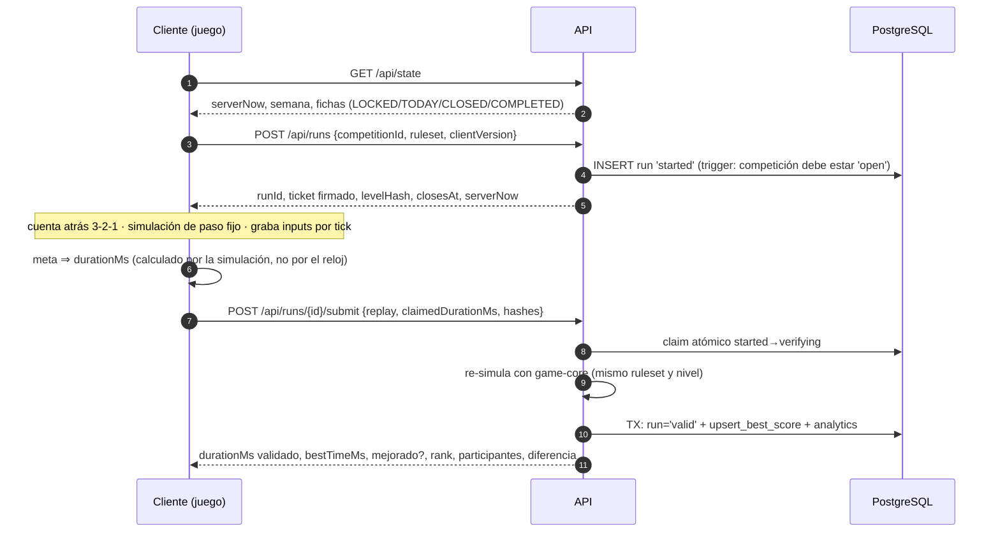

# 02 · Propuesta de arquitectura

> **Estado: PROPUESTA de la Fase 0 — nada de esto está implementado ni aprobado.** Las decisiones que necesito de ti están
> en [`04-decisions-and-questions.md`](04-decisions-and-questions.md); los hechos de World en [`01-…`](01-world-docs-review.md);
> el esquema en [`03-…`](03-database-schema-proposal.md).

## 1. Objetivos y principios

1. **El servidor es la autoridad** (tiempo, calendario, validez de un resultado). El cliente solo *propone*.
2. **Núcleo de juego determinista y compartido** (`game-core`): el mismo código corre en el móvil y en el servidor, de modo que el
   servidor pueda **re-simular** una partida en lugar de creerse el tiempo que declara el cliente.
3. **Todo es datos:** mapas, semanas, horarios, imágenes y textos se editan desde el panel admin, no en código.
4. **Móvil primero y gama baja incluida:** el resultado no depende de los FPS del teléfono (paso de simulación fijo).
5. **Aislamiento estricto de entornos** (local / staging / producción) con guardas técnicas, no solo convenciones.
6. **Privacidad por diseño:** solo un identificador pseudónimo (wallet), nada de datos personales.
7. **Honestidad sobre la seguridad:** cada control anti-trampa indica qué detiene *y qué no* (§9).
8. **Portabilidad:** Node + Postgres estándar, sin acoplarse a un proveedor.

## 2. Vista general

```
World App (WebView)                       Servidor (Node, sin estado)                Datos
┌────────────────────────────┐           ┌───────────────────────────┐          ┌─────────────────┐
│ Shell (Next.js / React)    │  HTTPS    │ API (route handlers)      │   SQL    │ PostgreSQL      │
│  Home · Leaderboard ·      │──────────▶│  auth · worldid · state   │─────────▶│ fuente de verdad│
│  Perfil · Ajustes          │           │  runs · leaderboard       │          │ y RELOJ (now()) │
│ ┌────────────────────────┐ │  replay   │ ┌───────────────────────┐ │          └─────────────────┘
│ │ Juego (chunk perezoso) │ │──────────▶│ │ game-core (headless)  │ │          ┌─────────────────┐
│ │ Pixi + input + audio   │ │           │ │ re-simula y valida    │ │─────────▶│ Object storage  │
│ │ game-core (mismo cód.) │ │           │ └───────────────────────┘ │          │ niveles/imágenes│
│ └────────────────────────┘ │           │ jobs idempotentes (cron)  │          └─────────────────┘
│ MiniKit · IDKit            │           └─────────────▲─────────────┘
└────────────────────────────┘                         │ verify / (notif, no activadas)
                                            Developer Portal de World        Panel Admin (app aparte)
```

## 3. Stack propuesto (y por qué)

| Capa | Propuesta | Por qué | Alternativa descartada (motivo) | ¿Cuenta / coste? |
|---|---|---|---|---|
| Lenguaje | **TypeScript estricto** en todo | Un solo lenguaje; `game-core` se ejecuta igual en navegador y Node; tipos compartidos de la API | — | No |
| Monorepo | **pnpm workspaces** vía `corepack` (sin instalar nada global) | Recomendado por World; evita dependencias fantasma | npm workspaces (válido, menos estricto) | No |
| Shell + API | **Next.js (App Router)**, versión estable actual; si hay incompatibilidad con paquetes de World, Next 15 | Es la base de la plantilla oficial; SSR/route handlers; despliega en cualquier Node | Vite SPA + API aparte (más piezas) | No |
| Render 2D | **PixiJS 8** (ver §5) | Solo render: control total del bucle de paso fijo; ligero | Phaser 4 (2× más pesado), Kaplay, Canvas propio | No |
| Física | **Decisión por *spike* en la Fase 5** (§5): Box2D v3 WASM → Rapier determinista → física propia | El anti-trampa exige física **determinista entre motores JS** | Planck/Matter (no deterministas) | No |
| Base de datos | **PostgreSQL** | Restricciones, transacciones, `NUMERIC(78,0)` para nullifiers; ver `03-…` | SQLite/D1 (menos garantías de concurrencia) | Local: PGlite, sin cuenta. **Alojada: Postgres del Marketplace de Vercel (Neon), decisión F1 del 2026-09-20; aprovisionarla requiere tu permiso** (puede facturarse vía Vercel) |
| Acceso a datos | **Drizzle ORM** + migraciones revisadas como SQL | Fino, SQL-first, encaja con las consultas a medida del leaderboard | Prisma (motor pesado) | No |
| Contratos de API | **zod** compartido cliente/servidor | Una sola definición de cada payload | — | No |
| Auth/sesión | **Propia**: SIWE (MiniKit) + token opaco con hash en BD | Revocable, sin librería que oculte el flujo; MiniKit no da sesiones | Auth.js (capa extra) | No |
| Hosting | **Vercel** (decisión H1 del 2026-09-20: la cuenta ya existe) | Lo más rápido con Next.js. **Hobby es solo uso no comercial y su cron corre como máximo 1 vez/día (±59 min)**; **Pro** da cron por minuto y **1 entorno personalizado** (`staging` persistente). Un juego con premios es uso comercial ⇒ Pro previsto | Contenedor Node (Fly/Railway), Cloudflare Workers | Cuenta existente; **plan (Hobby/Pro) pendiente de confirmar (H1a)** |
| Object storage | S3-compatible (**Cloudflare R2** recomendado) | Niveles, miniaturas, replays archivados | Vercel Blob/Supabase Storage | **Sí (más adelante)** |
| Rate limit / WAF | **Cloudflare** delante (plan gratuito) + contadores de negocio en BD | Límite por IP en el borde; por usuario en BD | Upstash Redis (otra pieza) | **Sí (más adelante)** |
| RPC World Chain | Proveedor propio para `verifySiweMessage` en producción | El RPC público por defecto puede limitar peticiones | RPC público (frágil) | **Sí (más adelante)** |
| Errores | Sentry (opcional) | Ver fallos en muchas WebViews | — | Opcional |
| Analítica | **Propia en Postgres** (§15) | Privacidad; respeta `optedIntoOptionalAnalytics` | PostHog/GA (datos a terceros) | No |
| CI | GitHub Actions (`gh` ya está instalado) | Tests + guardas de entorno | — | Repo en GitHub → pregunta H2 |
| Tests | Vitest · Playwright · fast-check · PGlite (unitarios) · Postgres real en CI (concurrencia) | Ver §18 | — | No (Docker no está instalado: CI usa *service containers*) |
| Túnel de pruebas | ngrok / zrok / tunnelmole (**citados en la doc de World**); cloudflared también serviría | Probar en un teléfono real | — | Puede pedir cuenta gratuita |

## 4. Estructura de carpetas propuesta

```
world-rush/                      (nombre de carpeta = codename; el nombre público se decide en A1)
├─ apps/
│  ├─ web/                       Mini App (Next.js): UI de menús + pantalla de juego + API
│  │  ├─ src/app/                rutas: (game)/play/[competitionId], api/**
│  │  ├─ src/features/           home · leaderboard · profile · settings · how-to-play · rewards (tras flag)
│  │  ├─ src/lib/world/          minikit.ts · idkit.ts · guardas de entorno · arnés de desarrollo (solo dev)
│  │  └─ public/                 sprites/audio con hash y caché larga
│  └─ admin/                     Panel admin (Next.js) — dominio, despliegue y autenticación SEPARADOS
├─ packages/
│  ├─ game-core/                 ⭐ simulación headless determinista (sin DOM)
│  │  ├─ src/sim/                envoltorio de física · modelo de moto · checkpoints · meta
│  │  ├─ src/replay/             códec del log de inputs · hashes · versiones de ruleset
│  │  ├─ src/level/              formato de nivel + validadores
│  │  └─ rulesets/r1/            binario de física + constantes FIJADOS (inmutables por versión)
│  ├─ game-client/               render (Pixi) · audio · controles táctiles · HUD
│  ├─ shared/                    zod, contratos de API, constantes, claves i18n
│  ├─ db/                        esquema Drizzle · migraciones · funciones SQL · consultas
│  ├─ server/                    servicios de dominio: auth · worldid · runs · validación · leaderboard · calendario · moderación
│  └─ config/                    eslint · tsconfig · esquema de variables de entorno (zod)
├─ tools/
│  ├─ level-compiler/            Tiled/LDtk → nivel compilado + hash + comprobación con replay de referencia
│  └─ sim-cli/                   re-simular un run en local y volcar hashes por tick (depuración de desincronías)
├─ docs/                         fase-0 → arquitectura, API, BD, integración World/MiniKit, runbooks, checklist
├─ .github/workflows/            CI (tests, guardas de entorno, migraciones)
└─ .env.example                  (sin secretos) · pnpm-workspace.yaml · tsconfig.base.json
```

Regla de dependencias: `game-core` **no importa nada** de DOM, React ni del servidor; `server` y `game-client` dependen de él,
nunca al revés. Así se puede probar y validar sin navegador.

## 5. Motor de juego: comparativa y recomendación (pregunta B5/B6)

Son **dos decisiones independientes**: (a) quién *dibuja* y (b) quién *simula la física* de forma verificable.

### 5.1 Por qué la física manda en el anti-trampa

Para validar en el servidor no basta con «creer» el tiempo: hay que **re-simular** los inputs y obtener el mismo resultado.
Eso exige física **determinista entre dispositivos**. Con librerías de física escritas en JavaScript hay un problema documentado:
la especificación de ECMAScript **no fija el resultado exacto de `Math.sin/cos`** (ni de otras funciones); V8 y SpiderMonkey usan portes de
*fdlibm* y **JavaScriptCore (iOS/Safari) usa `cmath`, la libm del sistema**; incluso versiones distintas de V8 han dado resultados distintos
en funciones matemáticas ([macwright](https://macwright.com/2020/02/14/math-keeps-changing.html)), y un proyecto de código abierto midió, sobre 20 000 argumentos entre −20 y 20, que **Node 26.9 y Chromium 141 difieren en 543 resultados de
`Math.sin` y en 627 de `Math.cos`** ([issue #471](https://github.com/jjgroenendijk/sunset-driver/issues/471); su autor describe el caso original como un redondeo distinto en 1 bit) — y eso comparando dos V8.
Rapier avisa de lo mismo en su guía de determinismo ([rapier.rs](https://rapier.rs/docs/user_guides/javascript/determinism/)).
Un móvil iOS y un servidor Node podrían por tanto **divergir** tras unos segundos de simulación caótica (rebotes, saltos). *No he
reproducido esa divergencia yo mismo*: es un riesgo documentado por terceros que el spike de §5.4 debe confirmar o descartar.
Las alternativas que sí lo garantizan: **WASM** (aritmética IEEE-754 idéntica en todos los motores, sin `Math.sin` del anfitrión) con un
motor que prometa determinismo — **Box2D declara determinismo entre plataformas desde la v3.1** ([FAQ oficial](https://box2d.org/documentation/md_faq.html))
y **Rapier** lo ofrece en su build *deterministic* — o una **física propia** que solo use `+ − × ÷` y `sqrt`.

### 5.2 Tamaños reales medidos (esbuild minificado + gzip, 2026-09-19)

| Candidato | min | **gzip** | brotli | Comentario |
|---|---|---|---|---|
| Phaser 4.2.1 (import completo) | 1 362 KB | **362 KB** | 290 KB | framework completo; el más pesado |
| PixiJS 8.21 (subconjunto típico: Application, Sprite, Assets, Container, Graphics, Text, TilingSprite, Texture) | 602 KB | **178 KB** | 145 KB | solo render |
| Excalibur 0.32 | 558 KB | 144 KB | 118 KB | motor con física propia |
| Kaplay 3001 | 189 KB | **70 KB** | 60 KB | ideal para prototipos; menos control fino |
| LittleJS 1.18 | 169 KB | 56 KB | 48 KB | pequeño; ecosistema reducido |
| Planck 1.5 (Box2D en JS) | 209 KB | **47 KB** | 39 KB | JS: **no determinista** entre motores |
| Matter 0.20 | 85 KB | 27 KB | 24 KB | JS; última versión jun-2024 |
| @box2d/core 0.11 | 236 KB | 52 KB | 44 KB | JS; Box2D 2.4 |
| **Box2D v3 → WASM** (`box2d3-wasm` 5.2.0) | wasm 407 KB + glue 95 KB | **≈ 175 KB** (149 + 25) | — | determinismo de Box2D 3.1; **port comunitario de una persona** |
| Rapier2D determinista (`-deterministic-compat`, WASM incrustado) | 2 101 KB | **781 KB** | 586 KB | oficial; determinismo documentado; **el más pesado** |
| Física propia en TS | ~0–10 KB | ~0–5 KB | — | determinista por construcción; **más trabajo y riesgo de calidad** |

Notas de método: cada candidato se empaquetó con un punto de entrada mínimo y `esbuild --minify`; el número de Pixi depende de qué se importe.
Del port `box2d3-wasm`: su `main` fija un commit de Box2D de **oct-2025 (posterior a v3.1.1, jun-2025)**, pero **no he podido confirmar la versión exacta de la 5.2.0 publicada** → 🧪 se comprueba en el *spike*.

### 5.3 Evaluación (móvil · física · táctil · peso · compatibilidad · velocidad de desarrollo · mantenimiento)

| Opción de **render** | Rendimiento móvil | Táctil | Peso | Velocidad dev | Mantenimiento | Encaje |
|---|---|---|---|---|---|---|
| **PixiJS 8** | Muy bueno (batching WebGL) | tú lo cableas (simple) | medio | media | ecosistema amplio | ⭐ **recomendado**: bucle fijo + interpolación, sin imponer física |
| Phaser 4 | Bueno | incluido | alto | **alta** | amplio | válido si priorizas herramientas listas frente a MB |
| Canvas 2D propio | Bueno con baja resolución interna | tú | **mínimo** | baja | tuyo | válido para arte pixel a baja resolución; sin efectos GPU |
| Kaplay | Correcto | incluido | bajo | muy alta | comunidad más pequeña (Kaboom no se actualiza desde may-2025; su continuación es Kaplay) | bueno para maqueta, no para control fino |

| Opción de **física** | Determinismo verificable | Peso | Riesgo | Encaje |
|---|---|---|---|---|
| **Box2D v3 WASM** | Sí (Box2D 3.1) 🧪 | ≈ 175 KB | port de un solo mantenedor | ⭐ primera opción a probar |
| Rapier determinista | Sí (documentado) | ≈ 781 KB | carga/parseo más lentos en gama baja | plan B |
| Física propia | Sí, por construcción | ~0 | desarrollo + calidad de física | plan C (o el elegido si el spike falla) |
| Planck / Matter / @box2d/core | **No garantizado** | 27–52 KB | validación solo *plausible*, no exacta | descartada para ranking |

### 5.4 Recomendación y *spike* (puerta de decisión en la Fase 5)

Arquitectura en **tres capas** independientes: `game-core` (simulación determinista) · renderer (Pixi) · shell (React). La física se
decide con un **spike de 2–3 días antes de construir el primer mapa**, con criterios de aceptación medibles:

1. **Determinismo:** el mismo log de inputs produce **idéntico hash de estado por tick** en Node, Android real y iPhone real (WKWebView en World App), 3 mapas × 3 repeticiones.
2. **Rendimiento:** simulación < 2 ms/frame y ≥ 55 FPS en un móvil de gama baja de referencia.
3. **Carga:** compilar + inicializar el WASM < 300 ms en gama media.
4. **Peso:** dentro del presupuesto de §14.

Si Box2D v3 WASM cumple → se adopta. Si no → Rapier (si el peso cabe) o física propia. **Necesito al menos un iPhone y un Android con World App** (pregunta D2).

## 6. Controles y vista de juego (pregunta B1/B2)

No fijo el esquema; estas son tres alternativas con su *trade-off* (todas: `touch-action: none`, sin selección de texto, zonas táctiles lejos de los bordes/gestos del sistema, tamaño/opacidad ajustables, opción de intercambiar manos):

| | **A · 4 botones digitales** (⭐ mi recomendación) | **B · Mitades de pantalla + inclinación analógica** | **C · Auto-gas + 2 botones** |
|---|---|---|---|
| Pulgar derecho | GAS y FRENO/MARCHA ATRÁS | mitad derecha = gas | (auto) |
| Pulgar izquierdo | INCLINAR ◀ / ▶ (rotación en el aire) | mitad izquierda = freno; **inclinación** por arrastre o giroscopio | INCLINAR ◀ / ▶ |
| Ventajas | Idéntico al esquema PC (↑↓←→) que conocen los jugadores de este género; **inputs binarios ⇒ replays diminutos y validación limpia**; máxima justicia entre dispositivos | Áreas táctiles enormes; jugable con un pulgar | El más simple; accesible |
| Inconvenientes | 4 objetivos; los pulgares tapan algo de pantalla | Inclinación analógica ⇒ replays más grandes y **ventaja según sensibilidad/dispositivo**; el giroscopio en iOS exige permiso (❓ no sé si World App lo permite) | Reduce el techo de habilidad (gestionar el acelerador en rampas es clave en un time-trial) |
| Encaje en ranking | ✅ | ⚠️ solo si se cuantiza el analógico | ⚠️ mejor como modo casual **no clasificatorio** |

**Vista en vertical (B2).** Un juego de este género pensado en horizontal enseña mucho terreno por delante; en vertical hay que
compensarlo con **zoom-out + cámara con anticipación (look-ahead) en la dirección de marcha**, y los controles superpuestos en la parte
inferior. Prototiparé en la Fase 5 dos composiciones — *canvas a pantalla completa* frente a *ventana casi cuadrada arriba + panel de
controles abajo* — y decidiremos con la jugabilidad real. El HUD (cronómetro, checkpoint, pausa) queda arriba **evitando la esquina
superior derecha** reservada por World App para sus controles ✅.

**Al chocar (B3):** *respawn* en el último checkpoint con el cronómetro corriendo (estilo del género; el run cuenta) ⟷ el run falla y
se reinicia ⟷ respawn con penalización fija. Cambia el formato del replay y la dificultad; lo decidimos juntos.

## 7. Autenticación e identidad (respuesta a §8 del brief)

**Principio:** *login* y *humanidad* son flujos distintos (✅ World lo exige).

### 7.1 Primer login (dentro de World App)

1. El shell arranca: `MiniKitProvider` instala MiniKit; se comprueba `MiniKit.isInstalled()`. Se leen `safeAreaInsets`, `MiniKit.location` y `optedIntoOptionalAnalytics` (solo como pistas de UI).
2. `GET /api/me` ⇒ 401 (sin sesión).
3. `POST /api/auth/nonce` ⇒ el servidor crea un nonce **aleatorio alfanumérico de un solo uso** (fila en `auth_nonces`, caduca en 5 min) — protegido con rate limit.
4. Cliente: `MiniKit.walletAuth({ nonce, statement, expirationTime, requestId })`.
5. `POST /api/auth/verify { payload, nonce }`. Servidor: **consume el nonce atómicamente** → `verifySiweMessage(payload, nonce, statement, requestId, viemClient)` → **comprobaciones adicionales propias:** `domain`/`uri` esperados y `chainId`; caducidad razonable.
6. *Upsert* de usuario por `wallet_address` en minúsculas → se resuelve **en el servidor** el username/avatar (servicio público de usernames) → se crea la **sesión**: token aleatorio de 256 bits, **solo su hash** en BD, cookie `__Host-` **HttpOnly + Secure + SameSite=Lax**, ventana deslizante 30 días con tope absoluto de 90.
7. Estado de humanidad: `users.human_verified_at` nulo ⇒ la UI ofrece «verificar» (obligatorio o no según **A2**).

### 7.2 Logins posteriores, cierre de sesión y reconexión

- Sesión válida ⇒ `GET /api/me` responde sin fricción. Se compara `MiniKit.user.walletAddress` con la de la sesión; **si difieren** (otra cuenta de World App en el mismo dispositivo) ⇒ revocar y reautenticar.
- Sesión caducada/revocada ⇒ `walletAuth` de nuevo (hoja de firma de World App).
- **Logout** = revocar en BD + borrar cookie. **Reconexión** = nuevo `walletAuth`. Acciones sensibles futuras (premios) exigirán *re-auth reciente* (< 5 min).
- Protecciones: **CSRF** (`SameSite` + comprobación de `Origin` + cabecera personalizada), respuestas idénticas ante fallos, límites por IP/usuario.
- 🧪 En Fase 3 se prueba en iPhone **y** Android: fricción de `walletAuth`, cookies en la WebView de Android y `domain` real del SIWE.

### 7.3 Humanidad (World ID / IDKit 4.x)

1. Usuario autenticado pulsa «Verificar». `POST /api/worldid/rp-context { action }` (requiere sesión; con rate limit) ⇒ el servidor **firma** con `RP_SIGNING_KEY` (**nunca** sale del servidor) y devuelve `{ sig, nonce, created_at, expires_at, rp_id }`.
2. Cliente: `IDKitRequestWidget` con `preset=proofOfHuman({ signal: <user.id> })`, `action` = `season-N-human`, `environment` acorde. Dentro de World App usa el transporte nativo (sin QR).
3. `handleVerify` ⇒ `POST /api/worldid/verify` (con sesión) ⇒ el servidor reenvía **la prueba intacta** a `POST https://developer.world.org/api/v4/verify/{rp_id}`; comprueba `success`, `environment`, `action` y el `signal` esperado.
4. Inserta `(user_id, action, nullifier)`: `UNIQUE(action, nullifier)` ⇒ si ese humano ya está ligado a **otra** cuenta ⇒ **409** («este World ID ya está vinculado a otro jugador»); si es la misma ⇒ idempotente.
5. `users.human_verified_at = now()`; la UI muestra la **insignia oficial *human***.
- **Nuevas temporadas:** una acción nueva por temporada permite re-verificar sin cambiar el modelo.
- **Cambio de wallet del mismo humano** (recuperación de cuenta): el nullifier seguirá siendo el mismo ⇒ hará falta un **proceso de soporte de reasignación** (diseño en Fase 3/4; sin él, el humano quedaría bloqueado por su propio nullifier).
- 🧪/❓ Abiertos de `01-…` §10 (#1–#4) se cierran **antes** de la Fase 3.

### 7.4 Fuera de World App y desarrollo local

- Fuera de World App: aterrizaje con enlace `https://worldcoin.org/mini-app?app_id=…` + QR, y (opcional, A8) leaderboard público de solo lectura. Sin juego clasificatorio.
- **Desarrollo local:** MiniKit solo funciona en World App, así que habrá un **arnés de desarrollo** (mock de `window.WorldApp` + verificador SIWE falso) que **no se compila en producción**: módulo aparte, `APP_ENV=development` obligatorio, ruta rechazada fuera de `localhost`, y un test de CI que falla si el bundle de producción contiene la ruta de dev-login.

## 8. Flujo de una partida y de envío/validación del score



**Estados del run:** `started → verifying → valid | invalid`; `abandoned` (reinicio/salida) y `expired` (TTL) se barren por job.
**Cronómetro:** el tiempo mostrado sale de los **ticks de la simulación** (paso fijo: por ejemplo 1/120 s o 1/125 s, a fijar en el spike),
con **interpolación sub-tick del cruce de meta** para obtener milisegundos enteros deterministas. No depende de `performance.now()` ni de los FPS.
**Pausa:** detiene la simulación (el tiempo del run no avanza) y se pausa sola con `visibilitychange`/`pagehide`. El servidor solo exige que el tiempo real transcurrido sea **≥** al del run.
**Sin red al terminar:** el run se guarda localmente y se reintenta (idempotente por `runId`) mientras el ticket siga vigente; la UI lo dice claramente.
**Reinicio a mitad de partida:** marca el run anterior `abandoned` y abre uno nuevo (alimenta «retry rate»).

### Tubería de validación (`validateRun`)

1. **Autenticación y propiedad:** el run pertenece a la sesión.
2. **Claim atómico** `started → verifying` (0 filas ⇒ ya procesado/caducado ⇒ respuesta idempotente).
3. **Ventana de tiempo** con el reloj de la BD: el run *empezó* antes del cierre y termina dentro de la gracia (`competition_accepts_scores`); TTL máximo de run.
4. **Versión:** `ruleset` y nivel (`content_hash`) coinciden con los de la competición; `clientVersion` ≥ mínimo.
5. **Límites del replay:** tamaño, nº de ticks, eventos monótonos, máscaras de input válidas, **tasa máxima de cambios de input**.
6. **Re-simulación determinista** headless ⇒ `durationMs`; debe **coincidir** con lo declarado y con los hashes de checkpoints (si no: `invalid: sim_mismatch`).
7. **Cota de tiempo real:** `submitted_at − started_at ≥ durationMs` (ambos del reloj de la BD). Para un cliente honesto siempre se cumple (`latencia_ida + duración + latencia_vuelta ≥ duración`).
8. **Plausibilidad** (marca, no rechaza): tiempo muy por debajo de la referencia del mapa, cadencia de inputs sobrehumana, mejora repentina respecto al historial.
9. **Duplicados:** mismo `replay_hash` en otra cuenta ⇒ rechazo duro + marca.
10. **Persistir** en una transacción: run `valid` + `upsert_best_score`. Si hubo marca blanda: `is_suspicious=true`, `review_status='pending'` (visible, pero en cola del admin).
11. Respuesta con el **rank y el «gap»** consultados tras confirmar.

Validación **síncrona** en la v1 (un run de 60–90 s ≈ 7 000–11 000 pasos; el coste esperado es sub-segundo — 🧪 se mide en el spike), con la función pura preparada para moverla a una **cola** si al cierre del día hay picos.

### Contrato de API (borrador)

| Método y ruta | Auth | Propósito |
|---|---|---|
| `GET /api/state` | opcional | `serverNow`, semana, fichas, estado del jugador |
| `POST /api/auth/nonce` · `POST /api/auth/verify` · `POST /api/auth/logout` · `GET /api/me` | — / sesión | login y perfil mínimo |
| `POST /api/worldid/rp-context` · `POST /api/worldid/verify` | sesión | prueba de humanidad |
| `POST /api/runs` · `POST /api/runs/{id}/submit` · `POST /api/runs/{id}/abandon` | sesión | ciclo de la partida |
| `GET /api/competitions/{id}/leaderboard?limit&cursor` | opcional | top + bloque «YOU» + participantes + tiempo ganador |
| `GET /api/me/profile` · `GET /api/me/weeks/{weekId}` | sesión | perfil y resultados semanales |
| `POST /api/analytics` | sesión | eventos por lista permitida (respeta `optedIntoOptionalAnalytics`) |

## 9. Anti-cheat: qué hace cada control y **qué NO hace**

| Control | Detiene | **No** detiene / límite honesto |
|---|---|---|
| **Re-simulación determinista en servidor** (tiempo = derivado del log de inputs) | Cualquier `POST time=12.31`; cambiar constantes de física en el cliente; teletransportes | **Bots/automatización de inputs** (un script que juega «perfecto»); *exploits* legítimos dentro de la física (fallos de mapa) |
| **Ticket de run firmado, de un solo uso, con TTL** (`run_id` + HMAC ligado a usuario/competición/ruleset) | Reenviar un resultado; usar el run de otro; inventar `run_id` | Un cliente modificado que juega runs legítimos con inputs automatizados |
| **Cota de tiempo real** (`elapsed ≥ duración`) | Enviar de golpe un run «precalculado» sin esperar; multiplicar el ritmo de envíos | Esperar el tiempo real cuesta poco al tramposo |
| **Límites de replay y de cadencia de inputs** | Bots toscos (>~10–12 cambios/s constantes) | Bots que aleatorizan el jitter |
| **Heurísticas estadísticas** (vs referencia, saltos de mejora, entropía de inputs) | Casos extremos → **cola de revisión** | Falsos positivos con jugadores excelentes ⇒ por eso *marcan*, no rechazan |
| **Hash de replay duplicado** | Copiar el replay de otro | Se evade cambiando un solo input |
| **World ID: un humano ↔ una cuenta** | Que una persona domine el top con muchas cuentas (Sybil) | Un humano verificado que use un bot; **alquiler/venta de cuentas** |
| **Rate limiting** (IP en el borde + cuotas por usuario en BD) | Fuerza bruta, spam de runs | Ataques distribuidos y lentos |
| **Cierre diario aplicado en BD** (triggers) | Errores de la app que aceptarían marcas tarde | Una app comprometida con permisos amplios |
| **Moderación admin** (invalidar + recalcular + auditoría) | Corregir errores y trampas descubiertas *a posteriori* | Es reactivo; requiere personas |
| **`MiniKit.attestation`** | ❓ *Podría* dar integridad de la app World; **no puedo contar con ello**: la verificación en servidor no está documentada | Aun funcionando, no prueba que **nuestro JS** no fue alterado |
| Ofuscación / anti-debug del cliente | — | **Falsa sensación de seguridad**: no invertiré en ello |

**Lo que NO se puede asegurar en un juego web** (dicho claramente): que el cliente no sea modificado; que las pulsaciones sean de un
humano y no de un script; que una cuenta verificada no se comparta o alquile; que no existan *exploits* en un mapa. Lo que sí garantiza
el diseño: **nadie puede declarar un tiempo que su partida no produzca**, y los casos sospechosos quedan **trazados y revisables**.
**Antes de repartir premios reales** (futuro) propongo además: retención de pago hasta terminar la revisión del top-N, revisión manual
de los replays ganadores y verificación reciente de humanidad al reclamar.

## 10. Leaderboard (detalle en `03-…` §4)

- Cada competición tiene el suyo; **una fila por jugador** (su mejor tiempo válido); los intentos anteriores no son posiciones.
- Muestra: top N, **tu posición**, tu mejor tiempo, **diferencia con el jugador anterior**, participantes y tiempo ganador. Si eres #1, el bloque «YOU» muestra 🥇 y sin diferencia.
- Paginación **por keyset** (sin `OFFSET`). El top público se cachea 5–10 s; el bloque «YOU» nunca.
- Tras finalizar: rangos **congelados** (`final_rank`). No se expone `wallet_address`; solo username/avatar (obtenidos en servidor) y la insignia *human*.

## 11. Cambio diario, semanas y zona horaria

- **Única fuente de verdad:** `competitions.opens_at/closes_at` (instantes UTC explícitos) + `now()` de Postgres. `competition_phase()` devuelve `locked | open | closed`. El frontend recibe `serverNow`, calcula el desfase y muestra la cuenta atrás con un reloj monótono; **el servidor decide siempre**.
- **UTC por dentro**, conversión a hora local solo para mostrar. Los instantes se generan una vez (sin depender de reglas de horario de verano en tiempo de consulta). **La zona horaria oficial del juego es decisión tuya (A3).**
- **Semanas:** jobs idempotentes garantizan que existan las próximas N semanas (por ejemplo 4) a partir de una plantilla/rotación definida en el admin. Si falta la siguiente, la UI muestra «próxima semana en camino» en lugar de fallar, y se avisa al admin.
- **Cierre:** al llegar `closes_at` la fase pasa a `closed` **por reloj** (sin depender de cron). `finalize_competition()` (tras `closes_at + gracia`) congela rangos, participantes y ganador; se ejecuta por cron **y** de forma perezosa en la primera lectura posterior (idempotente ⇒ un cron caído no rompe nada).
- **Rollover semanal:** domingo→lunes; la semana anterior pasa a `closed/finalized`; el perfil muestra «WEEK COMPLETE» con los 7 resultados. **La fórmula del campeón semanal NO se decide aquí (A5).**
- **Reglas de cambio de contenido:** una competición abierta **no** puede cambiar de `map_version`; los cambios de física exigen un `ruleset` nuevo y **nunca** se despliegan con una competición en curso sin mantener el validador del ruleset anterior.

## 12. Entornos y guardas

| | Local | Staging | Producción |
|---|---|---|---|
| BD | Postgres embebido/local (sin cuenta) | Proveedor aparte | Proveedor aparte (copias de seguridad) |
| App(s) del Developer Portal | app de desarrollo | app **separada** (no enviada a revisión) | app **de producción** (la revisada) |
| World ID | `environment: staging` + Simulator | acción/RP propios | acción/RP de producción |
| Secretos | `.env.local` (git-ignorado) | gestor de secretos del hosting | gestor de secretos del hosting (distintos) |
| Notificaciones/pagos | **desactivados** | **desactivados** | **desactivados hasta aprobación** |
| Datos | sintéticos | sintéticos/pruebas | reales |

**Guardas técnicas** (para que una prueba **no pueda** tocar el leaderboard de producción):
1. `system_meta.environment` en cada BD; la app **se niega a arrancar** si `APP_ENV` no coincide.
2. Esquema de variables (`zod`) que valida el conjunto completo por entorno y rechaza combinaciones incoherentes.
3. Las credenciales de producción **solo existen** en el hosting de producción; nadie las tiene en local; los workflows de CI de staging no pueden leerlas.
4. Migraciones de producción **manuales y con aprobación**, con copia previa; roles de BD separados (`app`, `admin`, `ro`, `migrate`).
5. Cada entorno usa su propio `RP_SIGNING_KEY`, API key del Portal y clave HMAC de tickets.
6. Interruptores por *feature flag* (`RANKED_ENABLED`, `REWARDS_ENABLED`, `NOTIFICATIONS_ENABLED`) apagados por defecto en cada entorno.

## 13. Seguridad: modelo de amenazas (base para la revisión de la Fase 10)

| Activo | Amenaza | Control |
|---|---|---|
| Sesión | robo/fijación | token opaco de 256 bits, solo hash en BD, `__Host-`+HttpOnly+Secure+SameSite, rotación, revocación, CSRF |
| Login | replay de SIWE / phishing entre apps | nonce de un solo uso + expiración + comprobación de `domain`/`uri`/`chainId` |
| `RP_SIGNING_KEY` | fuga ⇒ suplantar peticiones World ID | solo servidor, nunca `NEXT_PUBLIC_*`, jamás en logs, rotación documentada |
| API key del Portal | uso indebido | solo servidor; clave distinta por entorno |
| Leaderboard | tiempos falsos, duplicados, carreras | §8–§9 + restricciones de BD |
| Anti-multicuenta | Sybil | nullifier único por acción (§7.3) |
| Panel admin | acceso no autorizado | app y dominio separados, IdP con lista de permitidos, roles, **auditoría inmutable**, sin SDK de World |
| Base de datos | SQL injection / exceso de privilegios | consultas parametrizadas (Drizzle), roles mínimos, sin `DELETE` para la app |
| Abuso de API | scraping/DoS | WAF/rate limit en el borde + cuotas en BD + tamaños máximos de payload |
| Privacidad | filtración de wallets | la API no devuelve wallets; sin IP ni dispositivo en claro |
| Frontend | XSS / inyección | CSP estricta (con `wasm-unsafe-eval` solo si hace falta), sin HTML de usuario, sanitización de usernames |
| Cadena de suministro | dependencia maliciosa | versiones fijadas, `pnpm audit`/Dependabot, sin scripts `postinstall` innecesarios |
| Secretos | commit accidental | `.env*` ignorados, escaneo de secretos en CI, **nunca** secretos en el frontend |

## 14. Presupuestos de rendimiento (propuestos; se medirán)

| Métrica | Objetivo |
|---|---|
| JS inicial del shell (Home) | ≤ 150 KB gzip, sin el juego |
| Chunk del juego (Pixi + game-core + física) | ≤ 350 KB gzip (sin contar el WASM de física) |
| Paquete por mapa (sprites + audio + nivel) | ≤ 1,5 MB |
| Carga inicial | 2–3 s (objetivo de World) en 4G de gama media; acciones posteriores < 1 s |
| Tap PLAY → jugable | < 2 s (precarga en reposo desde Home) |
| Fluidez | 60 FPS objetivo; degradación graceful (resolución interna 0,75/0,5×, tope de partículas) |
| Memoria de texturas | ≤ 64 MB |
| Arte | resolución interna baja + escalado entero con `image-rendering: pixelated`; atlas WebP/PNG-8; ≤ 4 capas de parallax |
| Audio | AAC/M4A (compatible con iOS y Android), carga bajo demanda, pausa al ir a segundo plano |
| Simulación | independiente del FPS (paso fijo); nada de asignaciones en el bucle; *pools* de objetos |

## 15. Analítica mínima y privada

Solo eventos de una **lista cerrada de 9**: `app_open`, `login`, `worldid_verified`, `race_start`, `race_finish`, `race_crash`, `race_restart`, `leaderboard_view`, `share`.
Sin PII, sin *fingerprinting*; **los eventos opcionales solo se envían si `optedIntoOptionalAnalytics` es `true`**. La mayoría de métricas se derivan de `runs`/`best_scores`:

| Métrica del brief | Fuente |
|---|---|
| DAU / WAU / nuevos / recurrentes / retención | `sessions.last_seen_at`, `users.created_at`, `app_open` |
| Carreras iniciadas / completadas / intentos por usuario / retry rate | `runs` (`started`, `valid`, `abandoned`) |
| Tiempo medio, mejor tiempo, participación diaria, tasa de finalización del mapa | `best_scores`, `runs.duration_ms`, `competitions` |
| Crash rate | `race_crash` (contador por run) |
| Vistas del leaderboard | `leaderboard_view` |

## 16. Recompensas y notificaciones: solo preparación

- **Recompensas:** la pestaña queda tras un *feature flag* (A7). Se reservan `competitions.kind`, y el diseño de `prize_pools`, `entries`, `payouts` (libro mayor *append-only*, idempotente). **No se implementa economía alguna ni se piden permisos de gasto.** Cuando se apruebe: decidir custodia (contrato de reclamo vs tesorería en servidor), premios **por habilidad** solamente, y revisión legal de concursos de habilidad por jurisdicción (no es asesoría legal).
- **Notificaciones:** requieren permiso en el Portal, opt-in del usuario y API key (§7 de `01-…`). Un *job* respetaría un tope diario por usuario. **No se configura ni se activa nada.**

## 17. Panel de administración

App **separada** (dominio y despliegue propios), autenticación mediante un proveedor de identidad con lista de admins (**decisión E2**), roles `owner/moderator/viewer`, cada acción a `audit_log` inmutable.
Funciones: crear/activar/desactivar mapas · **subir paquetes de nivel compilados** (nombre, imagen, dificultad, versión) · configurar semanas y horarios · ver jugadores · **cola de scores sospechosos** con visor de replay · invalidar/recalcular · revisar leaderboards · estadísticas.
**Pipeline de niveles:** el editor externo (Tiled/LDtk) → `tools/level-compiler` valida el esquema, calcula el hash y **ejecuta un replay de referencia** (demuestra que el nivel es completable y fija `par_time_ms`) → el admin lo sube y crea la `map_version`. Un **editor visual dentro del panel** es mucho más trabajo: propongo dejarlo fuera de la v1 (pregunta E2).

## 18. Estrategia de pruebas (brief §31)

| Área | Cómo |
|---|---|
| Autenticación / login / SIWE | unitarios con firmas de prueba, expiración, nonce reutilizado, `domain` erróneo |
| Verificación World ID | contra respuestas simuladas + Simulator de World ID; repetición de nullifier rechazada |
| Calendario, cierre, zona horaria, rollover semanal | reloj inyectable (`Clock`), casos límite `[opens_at, closes_at)`, cambios de horario de verano, cambio de semana |
| Envío de score, mejor marca, duplicados, sospechosos | dorados de replays (hash por tick), mutaciones de replay, `fast-check` |
| Orden del leaderboard | propiedad: orden total, keyset = OFFSET, rank = posición |
| Carreras/concurrencia | **Postgres real multi-conexión en CI** (envíos paralelos del mismo usuario y de muchos) |
| Jugabilidad | tests del `game-core` headless (física, checkpoints, meta) + *golden replays* por mapa |
| UI/flujos | Playwright con MiniKit simulado; dispositivos reales para lo demás |

## 19. Fases (adaptadas del brief; **cada una termina con informe y espera tu aprobación cuando hay decisión importante**)

Formato de informe por fase: *qué hice · archivos cambiados · cómo probarlo · qué queda · problemas*.

| Fase | Contenido | Acciones que requieren tu permiso |
|---|---|---|
| **0 (esta)** | Investigación, arquitectura, preguntas | — |
| 1 | Arquitectura + setup: monorepo, tooling, scripts de verificación, esquema de env, **BD local y migración base de auth** (adelanto de la Fase 4 porque la autenticación la necesita) | `git init` local (trivial); instalar dependencias |
| 2 | Integración World/MiniKit: proveedor, arnés de dev, cierre de los ❓/🧪, primer «hola» en un teléfono real | **Cuenta/app del Developer Portal, túnel público, dispositivo** |
| 3 | Autenticación + humanidad (SIWE, sesiones, IDKit, nullifier) | RP/acción y secretos en el Portal |
| 4 | Base de datos completa (Drizzle, migraciones, funciones) | Proveedor Postgres (staging) — más adelante |
| 5 | **Spike de determinismo** + prototipo de gameplay | Ninguna (dos móviles reales) |
| 6 | Primer mapa (arte provisional) | Arte definitivo (C1) |
| 7 | Leaderboard + validación de replays | — |
| 8 | Calendario diario, semanas, jobs | Cron/hosting |
| 9 | Pulido UI/UX (Home según tu mock, tiempos de carga, estados de error/offline) | — |
| 10 | Seguridad (revisión + endurecimiento) | — |
| 11 | Testing completo (concurrencia real) | CI |
| 12 | Cumplimiento World (checklist [`05-…`](05-world-miniapp-checklist.md)) | Ficha en el Portal, envío a revisión |
| 13 | Staging | Hosting, dominio, secretos |
| 14 | Producción | **Despliegue, migraciones, notificaciones (si se aprueban)** |

Ajuste que propongo: tests y revisión de seguridad **continuos desde la Fase 1**; las Fases 10–11 son pasadas de endurecimiento, no el primer contacto.

## 20. Cobertura del brief

| Brief | Dónde |
|---|---|
| §1–5 concepto, mecánica, semanas, time trial, intentos | `03-…` §1–§4, §8 de este doc |
| §6 anti-cheat | §8–§9 |
| §7–8 World ID y login | §7 y `01-…` §3–§4 |
| §9–10 base de datos y leaderboard | `03-…`, `schema-proposal.sql` |
| §11 bloqueo diario y zona horaria | §11, pregunta A3 |
| §12–13 Home y fichas | `03-…` §4 (estados), pregunta C2 |
| §14–15 partida y controles | §6, §8 |
| §16–17 arte y UI en World App | §14, `01-…` §6, pregunta C1–C2 |
| §18 MiniKit | `01-…` §1–§2 |
| §19–21 wallet, rewards, notificaciones | §16, `01-…` §7–§8 |
| §22–23 perfil y resultados semanales | `03-…` §4; fórmula del campeón = A5 |
| §24 admin | §17 |
| §25 analítica | §15 |
| §26 seguridad | §13 |
| §27 rendimiento | §14 |
| §28 motor | §5 |
| §29 stack | §3 |
| §30 entornos | §12 |
| §31 testing | §18 |
| §32 checklist World | [`05-…`](05-world-miniapp-checklist.md) |
| §33 documentación | esta carpeta; el resto se completa por fases |
| §34–35 permisos y preguntas | [`04-…`](04-decisions-and-questions.md) |
| §36–37 fases y primer paso | §19 |
