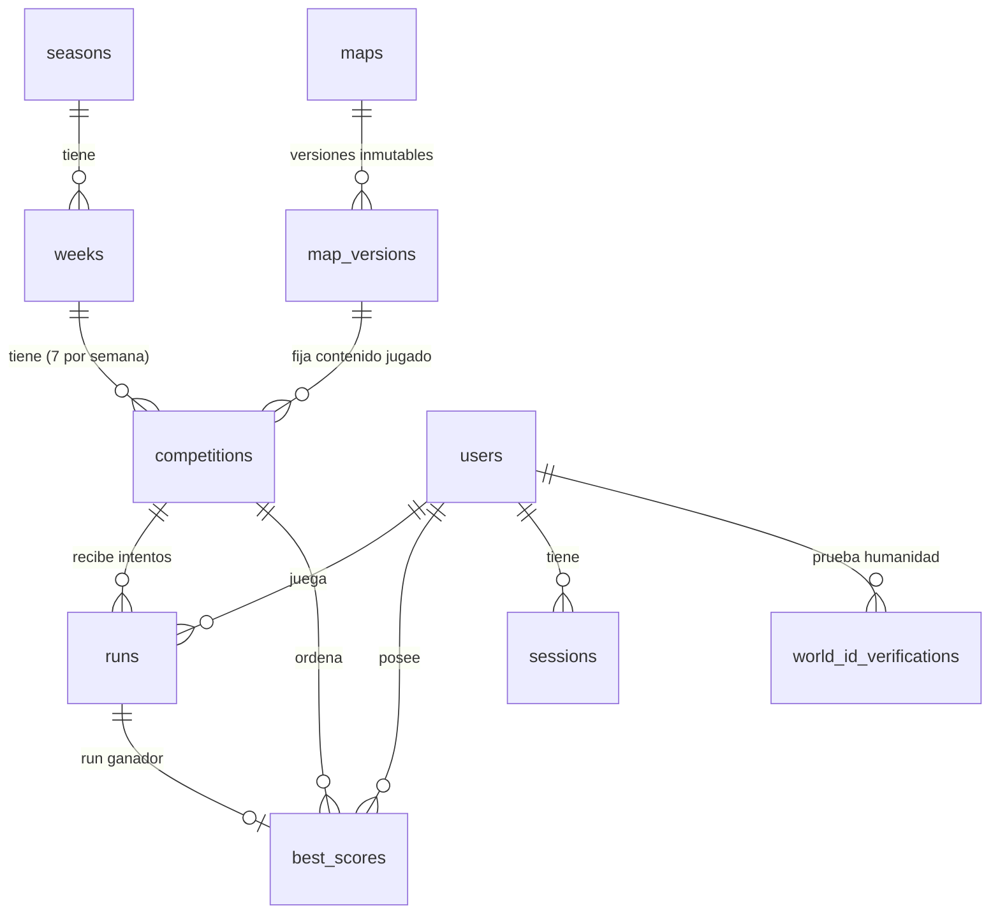

# 03 · Esquema de base de datos (propuesta validada)

> **Estado: PROPUESTA de la Fase 0.** No existe ninguna base de datos creada ni ninguna cuenta conectada.
> El DDL completo está en [`schema-proposal.sql`](schema-proposal.sql). Se ejecutó en **PostgreSQL 18.3 real**
> (PGlite) con **45 comprobaciones automáticas** más **6** de consultas de perfil/semana
> ([`evidence/schema-validation.mjs`](evidence/schema-validation.mjs)). Ver §12 para lo que **no** se pudo probar.

## 1. Principios de diseño

1. **El reloj de la base de datos es la única fuente de verdad.** Todas las decisiones de tiempo usan `now()` de Postgres,
   nunca el dispositivo ni el reloj de la app (varias instancias serverless tendrían relojes distintos).
2. **No hay tabla de leaderboard.** El leaderboard es una *consulta ordenada* sobre `best_scores` (una fila por
   competición + jugador). No se duplica información ni hay nada que sincronizar.
3. **Orden total y determinista:** `(best_time_ms, achieved_at, user_id)`. A igual tiempo gana quien lo logró antes;
   el último criterio (`user_id`) solo garantiza que el orden nunca sea ambiguo.
4. **Tiempos en milisegundos enteros** (`integer`). Sin floats. Un run de 28.421 s se guarda como `28421`.
5. **Contenido inmutable y versionado.** Un replay solo es válido contra el nivel + *ruleset* exacto con el que se grabó,
   así que `map_versions` es inmutable y cada `competition` fija su versión (con FK compuesta que impide mezclar mapas).
6. **El estado de una competición se deriva del reloj** (`competition_phase()`), no de un cron. El cron solo *materializa*
   (`finalize_competition`): si falla un cron, el juego sigue siendo correcto.
7. **Defensa en profundidad:** cada regla crítica (día cerrado, un humano ↔ una cuenta, mapa ↔ versión) tiene además una
   restricción/trigger en la base de datos, no solo validación en la app.
8. **Sin datos personales innecesarios** (ver §10).
9. **Extensible sin migraciones de esquema** para nuevas semanas, mapas, temporadas y eventos (`kind`, `seasons`, `weeks`).

## 2. Entidades



## 3. Correspondencia con el brief (§9)

| Brief | Tabla(s) | Notas |
|---|---|---|
| Users | `users`, `sessions`, `auth_nonces`, `world_id_verifications` | Identificador de auth = `wallet_address` (SIWE). Humanidad = `nullifier`. |
| Weeks (+ season) | `seasons`, `weeks` | `week_number` único por temporada. |
| Maps | `maps` + `map_versions` | `catalog_number` es solo de catálogo; **el día no vive en el mapa** sino en la competición (así un mapa se reutiliza). |
| Daily Competitions | `competitions` | `opens_at`/`closes_at` son *instantes explícitos* (UTC): la zona horaria solo interviene al generarlos. |
| Runs / Attempts | `runs` | Conserva **todos** los intentos (auditoría/analítica). |
| Best Scores | `best_scores` | PK `(competition_id, user_id)`; `final_rank` se congela al finalizar. |
| Leaderboard | *(consulta)* | Sin tabla propia (§4). |
| Admin / auditoría | `admin_users`, `audit_log` (append-only) | Triggers impiden `UPDATE`/`DELETE` del log. |
| Analytics | `analytics_events` + derivado de `runs` | Lista cerrada de 9 eventos, sin PII. |

## 4. Consultas del leaderboard (todas ejecutadas contra Postgres real)

```sql
-- Top N (con datos de display; nunca se expone wallet_address)
select b.best_time_ms, b.achieved_at, u.username, u.avatar_url, (u.human_verified_at is not null) as human
  from best_scores b join users u on u.id = b.user_id
 where b.competition_id = $1 and b.is_visible
 order by b.best_time_ms, b.achieved_at, b.user_id
 limit 50;

-- Página siguiente (paginación por KEYSET: sin OFFSET, estable aunque entren marcas nuevas)
   ... and (b.best_time_ms, b.achieved_at, b.user_id) > ($t, $a, $u)   -- cursor = última fila vista
 order by b.best_time_ms, b.achieved_at, b.user_id limit 50;

-- Posición del jugador ("YOU #147")
select 1 + count(*) as rank from best_scores
 where competition_id = $1 and is_visible and (best_time_ms, achieved_at, user_id) < ($t, $a, $u);

-- Diferencia con el jugador inmediatamente anterior
select best_time_ms from best_scores
 where competition_id = $1 and is_visible and (best_time_ms, achieved_at, user_id) < ($t, $a, $u)
 order by best_time_ms desc, achieved_at desc, user_id desc limit 1;       -- 0 filas ⇒ eres #1

-- Participantes y tiempo ganador (tras finalizar salen de competitions.participants_count / winner_time_ms)
select count(*), min(best_time_ms) from best_scores where competition_id = $1 and is_visible;
```

**Resultados semanales, perfil, récords y fichas de Home** (independientes de la fórmula del campeón semanal, que sigue
pendiente de tu decisión — ver `04-…`):

```sql
-- Resultados de una semana para un jugador (rank congelado si ya cerró; en vivo si sigue abierta)
select c.day_of_week, m.name, competition_phase(c) as phase, b.best_time_ms,
       coalesce(b.final_rank,
                (select 1 + count(*) from best_scores x
                  where x.competition_id = c.id and x.is_visible
                    and (x.best_time_ms, x.achieved_at, x.user_id) < (b.best_time_ms, b.achieved_at, b.user_id))) as rank,
       c.participants_count
  from competitions c join maps m on m.id = c.map_id
  left join best_scores b on b.competition_id = c.id and b.user_id = $1
 where c.week_id = $2 order by c.day_of_week;

-- Perfil: carreras iniciadas / completadas, mapas con tiempo, mejor posición final
select (select count(*) from runs where user_id = $1)                                  as races_started,
       (select count(*) from runs where user_id = $1 and status = 'valid')            as races_completed,
       (select count(*) from best_scores where user_id = $1)                          as maps_completed,
       (select min(final_rank) from best_scores where user_id = $1 and final_rank is not null) as best_final_rank;

-- Récords personales por mapa (a través de semanas)
select m.name, min(b.best_time_ms) as personal_best_ms, count(*) as times_played
  from best_scores b join competitions c on c.id = b.competition_id join maps m on m.id = c.map_id
 where b.user_id = $1 group by m.id, m.name;
```

**Estados visuales de las fichas** (los calcula el servidor, no el cliente):

| `competition_phase()` | ¿El jugador tiene tiempo? | Ficha |
|---|---|---|
| `locked` (aún no abre) | — | **LOCKED** |
| `open` | no / sí | **TODAY** (con ✓ y tu tiempo si ya lo tienes) |
| `closed` | no | **CLOSED** |
| `closed` | sí | **COMPLETED** (con tu posición final) |

Los límites son **semiabiertos** `[opens_at, closes_at)`: verificado que `closes_at − 1 ms` es `open` y `closes_at` ya es `closed`.

## 5. Concurrencia y transacciones

| Situación | Patrón | Verificado |
|---|---|---|
| Nonce SIWE de un solo uso | `UPDATE auth_nonces SET consumed_at = now() WHERE nonce=$1 AND consumed_at IS NULL AND expires_at > now() RETURNING …` (0 filas ⇒ inválido/reutilizado) | por diseño (Fase 3) |
| Alta/login de usuario | `INSERT … ON CONFLICT (wallet_address) DO UPDATE SET last_login_at = now() RETURNING *` | unicidad probada |
| Iniciar run | INSERT + trigger `runs_start_lock` (competición debe estar `open`) | ✅ probado |
| Enviar run | `UPDATE runs SET status='verifying', submitted_at=now() WHERE id=$1 AND user_id=$2 AND status='started' RETURNING …` → solo un envío “gana” el claim; el resto recibe el resultado ya guardado (idempotente) | por diseño (Fase 7) |
| Mejor marca | `upsert_best_score()` = `INSERT … ON CONFLICT DO UPDATE … WHERE excluded.best_time_ms < best_scores.best_time_ms` (atómico, monótono) | ✅ semántica probada (30 envíos desordenados ⇒ queda el mínimo; empate exacto conserva el más antiguo) |
| Un humano ↔ una cuenta | `UNIQUE (action, nullifier)` y `UNIQUE (user_id, action)`; capturar `23505` | ✅ probado con un nullifier de 256 bits (`NUMERIC(78,0)`) |
| Cierre diario | triggers `runs_start_lock` y `best_scores_lock` + comprobación en la app | ✅ probado |
| Finalizar | `finalize_competition()` bloquea la fila de la competición, es **idempotente** | ✅ probado (2ª ejecución no cambia nada) |
| Moderación | `admin_invalidate_run()` recalcula la mejor marca desde los runs válidos restantes y escribe `audit_log` | ✅ probado |

Aislamiento: `READ COMMITTED` (por defecto) basta porque cada regla se resuelve con una sola sentencia atómica o un
bloqueo de fila explícito. No se necesita `SERIALIZABLE`.

> ⚠️ **Límite honesto de la validación:** PGlite es de **una sola conexión**, así que la *semántica* de `ON CONFLICT` y los
> triggers está probada, pero las **carreras reales entre conexiones simultáneas** deben probarse en la Fase 11 contra
> Postgres multi-conexión (contenedor en CI). No lo marco como verificado.

## 6. Bloqueo diario

- La app comprueba `competition_phase()` **y** la base de datos lo impone (`runs_start_lock`, `best_scores_lock`).
- **Regla de gracia (propuesta, pendiente de tu aprobación — pregunta A4):** un run **iniciado antes** del cierre puede
  *terminar* hasta `grace_seconds` (120 s por defecto) después; un run **nuevo** ya no puede empezar. Así nadie pierde un
  run en curso por un segundo, y el lunes nunca se puede “seguir jugando” el martes.
- **Límite de los triggers:** cualquier rol puede fijar el GUC `worldrush.admin_override`, así que los triggers protegen
  contra *bugs de la app*, no contra una app comprometida. Para eso: roles separados y funciones `SECURITY DEFINER`
  solo para el panel admin (ver comentario “Roles” al final del SQL).

## 7. Índices y restricciones clave

| Objeto | Para qué |
|---|---|
| `best_scores_rank_idx (competition_id, best_time_ms, achieved_at, user_id) WHERE is_visible` | top-N, keyset, rango, “diferencia con el anterior” |
| `best_scores_final_rank_uidx (competition_id, final_rank) WHERE final_rank IS NOT NULL` | leaderboard congelado O(1); garantiza posiciones únicas |
| `runs_replay_hash_idx (competition_id, replay_hash)` | detectar replays duplicados entre jugadores |
| `runs_review_pending_idx … WHERE review_status='pending'` | cola de revisión del admin |
| `runs_open_idx … WHERE status IN ('started','verifying')` | barrer runs caducados |
| `users_wallet_uidx`, `wid_action_nullifier_uq`, `wid_user_action_uq` | identidad y anti-multicuenta |
| FK compuesta `competitions(map_version_id, map_id) → map_versions(id, map_id)` | imposible fijar la versión de otro mapa (probado) |
| `UNIQUE (week_id, day_of_week)`, `UNIQUE (week_id, map_id)` | un solo mapa por día y semana |
| `CHECK wallet_address ~ '^0x[0-9a-f]{40}$'` | normalización obligatoria (minúsculas) |

## 8. Rendimiento medido (orientativo)

Datos sintéticos: **196 907 jugadores en una competición**, PGlite (Postgres compilado a WASM, mono-hilo; **mucho más lento
que Postgres nativo**, así que sirve para el *orden de magnitud* y para confirmar planes, no como benchmark). Dos ejecuciones,
la segunda con la máquina más cargada:

| Consulta | Tiempo | Plan |
|---|---|---|
| Top 50 (+ join a `users`) | 2–12 ms | índice `best_scores_rank_idx` |
| Página keyset en la posición ~150 000 | 1–4 ms | índice |
| Diferencia con el anterior | ≈ 0,1–0,2 ms | índice |
| **Posición (rank) de un jugador en el puesto ~150 000** | **0,2–0,8 s** | `Seq Scan` + `COUNT` (cuenta ~150 000 filas) |

Conclusión honesta: todo lo que devuelve “una página” cuesta lo mismo con 200 k que con 200 filas. **La única consulta que
crece con el tamaño es el rank exacto**, porque es un `COUNT` proporcional a la posición. Es esperable que Postgres nativo
sea varias veces más rápido (**no verificado**; se re-mide en Fases 4 y 11 sobre el proveedor real).

## 9. Plan de escala del rank (solo si hace falta; sin implementar)

- **Hasta ~50 k participantes por competición:** `COUNT` exacto, sin más.
- **Más:** (a) caché por competición con checkpoints de rank (rank = prefijo acumulado + conteo dentro del tramo),
  (b) Redis `ZSET` (`ZRANK` en O(log N)), o (c) mostrar rank *aproximado* fuera del top 10 000 (decisión de producto).
  Ninguna está medida todavía. La interfaz `LeaderboardService` las esconde tras un contrato estable.
- El top público se cachea 5–10 s en CDN/memoria (los datos son públicos y sin wallet); el “YOU” nunca se cachea.

## 10. Privacidad y retención

**Guardamos:** `wallet_address` (pseudónimo; identificador de auth), `username`/`avatar_url` como *caché* obtenida
**en el servidor** del servicio público de usernames de World (nunca de lo que envíe el cliente), `nullifier` (no reversible,
acotado por app+acción), tiempos e inputs de los runs.
**No guardamos:** mensaje/firma SIWE tras verificar, IP en claro, identificadores de dispositivo, `verificationStatus`
del cliente como verdad, la prueba ZK completa (solo nullifier + metadatos), contactos, nombres reales.
**La API nunca devuelve `wallet_address`** en leaderboards ni perfiles públicos.

**Retención propuesta (a confirmar, pregunta F2):** `runs`/`best_scores` se conservan (auditoría e histórico). El `replay`
completo se conserva 30 días, salvo top-100 de cada competición y runs sospechosos (indefinido). `analytics_events` 180 días
y luego agregado diario. `auth_nonces` y `sessions` caducadas se purgan a diario.
**Borrado de cuenta:** `status='deleted'` + anonimización (username/avatar nulos, wallet sustituida por un tombstone); los
tiempos de competiciones cerradas se conservan como “Jugador eliminado”.

## 11. Diseño reservado (NO implementado; solo garantizar que encaje)

`prize_pools` · `entries`/`payouts` (libro mayor *append-only*, pagos idempotentes) · torneos/eventos (`competitions.kind`)
· campeón semanal (**fórmula sin decidir**; se calcula desde `best_scores`/`final_rank`) · logros · preferencias de
notificación (`users.notifications_opt_in`) · archivo de replays en object storage · consentimientos.
Ninguna requiere cambiar las tablas actuales, solo añadir las nuevas.

## 12. Qué se validó y qué NO

**Validado (PostgreSQL 18.3 vía PGlite, 51 aserciones):** el DDL carga; 17 tablas; FK compuesta; `UNIQUE`/`CHECK`;
nullifier de 256 bits; fases del reloj y límites semiabiertos; triggers de bloqueo diario; upsert atómico y monótono
(incluido empate); una fila por jugador con todos los intentos conservados; orden = `row_number()`; keyset = `OFFSET`;
rank por `COUNT` = `row_number()`; diferencia con el anterior; invalidación con recálculo y auditoría inmutable; baneo;
finalización con rangos 1..N sin huecos e idempotente; consultas de perfil/semana/récords/fichas.

**NO validado:** concurrencia real multi-conexión (Fase 11); rendimiento en Postgres nativo/proveedor real; comportamiento
con Neon/Supabase (sin cuenta); migraciones con Drizzle (aún no existe); roles/`SECURITY DEFINER`; volumen > 200 k.

## 13. Riesgos abiertos

1. **`achieved_at` como desempate** favorece a quien juega antes; es la regla estándar de leaderboards, pero es una decisión
   de producto (pregunta F3).
2. **Rank exacto a gran escala** (§8–9): aceptable hasta ~50 k; decidir estrategia si el juego despega.
3. **Ruleset por competición:** hay que conservar para siempre el binario de física de cada `ruleset` para poder re-validar.
4. **Caducidad de credenciales World ID** (`expires_at_min` en la respuesta v4): semántica sin verificar; podría exigir una
   política de re-verificación y una columna `credential_expires_at`.
